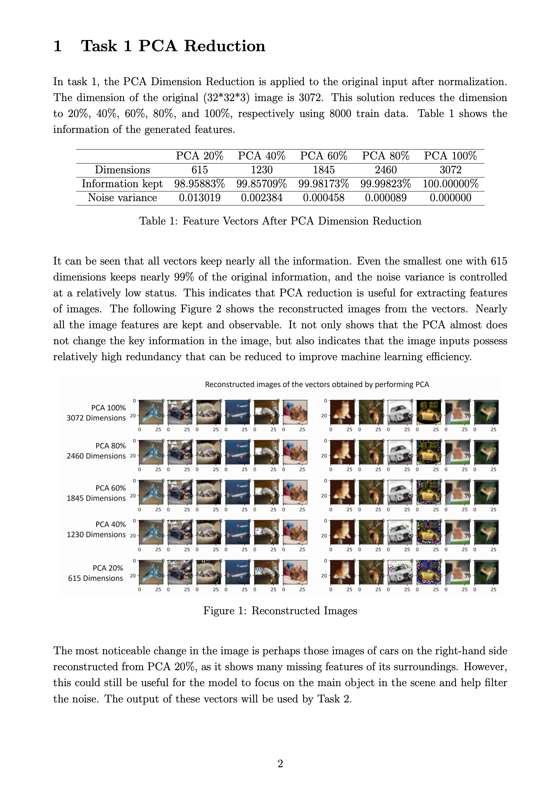

# UoN - COMP3055 Machine Learning Coursework README

## Author: Feiyang Wang

## This repository is posted after submission deadline and the grading of the work.

## Please check the [report.pdf](/work_report.pdf) for performance evaluation of this work. The report is also attached at the end of this readme.

## 1. Introduction of work

This work involves using Machine Learning techniques including PCA (with reconstruction), SVM (Linear/RBF Kernel), 5-Fold Cross Validation, CNN Design (ResNet, DenseNet),  etc. CIFAR-10 dataset is used for training and testing purposes. 

The first task applies PCA to reduce the original input feature vectors. I have applied 20%, 40%, 60%, 80%, 100% PCA to the data. Also a reconstruction option is provided to reconstruct the features after the PCA processing. 

The second task is to use SVM to achieve an object recognition system. I have trained the linear SVM and SVM with RBF kernel with different C values to implement the multi-class classification to the training data. Then I have applied 5-fold cross validation to train and validate the models for input features. 

The third task is to design 5 different CNNs. Also these models are trained and tested on the CIFAR-10 dataset to compare and contrast the performance differences between various CNN designs. 

## 

## 2. Files and Environment Requirements

The uncompressed files will include the following, please check file integrity:

- main.py

- task1.py

- task2.py 

- task3_net.py

- task3_utils.py

- utils.py  

- README.md

- README.pdf

- requirements.txt  

Please run `pip install -r requirements.txt` to a newly created environment to install all the necessary libraries. 

This coursework uses python 3.7 and main libraries such as pytorch 1.12.1 + CUDA 11.3, scikit-learn 1.0.2, and matplotlib to implement most functions. 

The task 1 and task 2 of this coursework relies on pure CPU calculation, and task 3 is trained and validated using a RTX 3070 8GB. Please note that for task 1 and task 2, 8000 training data is used, which could lead to slow training (about 500 seconds for training each Linear SVM or SVM + RBF kernel using intel i7 10700); for task 3, the full dataset is used by default. A smaller training dataset can be used to speed up according to the *Section 4. Parameters for Modification* in this README file. 

## 

## 3. How to Run the Code

`main.py` is the entry of this coursework solution, and running `python main.py` without changing any of the content will produce all the required models, scores, and figures requested by the coursework issue sheet. 

#### Folders created

When running `main.py`, four folders under the current directory will be created, which are `/data`, `/figs`, `/models`, and `/records`.

The `/data` folder will include the downloaded CIFAR-10 dataset using pytorch. The original dataset will be extracted to be stored as `CIFAR10_Raw.npz` file, and reduced dataset will be stored as a `CIFAR10_Reduced.npz` file in the data folder. Then, for Task 1 and Task 2, the program will load the reduced dataset by default as the input, which includes 8000 train data and 1000 test data.

All the figures generated by this program will be saved to `/figs`, it will not replace the existing figures to prevent accidental overwriting. Instead, it will append counters to the end of the file name, i.e. _1, _2, _3 ... accordingly.

Meanwhile, for Task 3, the produced model will be saved in `/models`, and training logs will be saved to `/records`. 

#### 

## 4. Work Processes

##### Task 1

For task 1, the new feature vectors reduced from original input will be stored in variables based on the dimensions it keeps, which include 20%, 40%, 60%, 80%, 100%, and Original (apply scale and normalization for data consistency).  

For train vectors, variables are: x_train_20_flat, x_train_40_flat, x_train_60_flat...

For test vectors, variables are: x_test_20_flat, x_test_40_flat, x_test_60_flat...

By default, the function in task 1 will generate the reconstructed images from the vectors after PCA reduction.

##### Task 2.1

The Linear SVM models are generated using different input feature vectors from task 1 and are stored in the variable svm_20, svm_40, svm_60...

The 5-fold cross validation results for each model will be printed in the console and figures will be plotted and stored in `/figs`.

##### Task 2.2

The Linear SVM models generated in Task 2.1 will be tested on both the train and test data to check the degree of overfitting. 

Meanwhile, the precision, recall, f1 values for each class using models which are trained on different feature dimensions will be generated. 

Finally, the average precision, recall, and f1, as well as the overall accuracy for these models will be generated. 

These generated results will be printed in the console and figures will be plotted and stored in `/figs`. 

##### Task 2.3

The SVM with RBF kernel with different C values are trained using the original train data. C values are:
[0.00001, 0.0001, 0.001, 0.01, 0.1, 0.25, 0.5, 0.75, 1, 2, 3, 4, 5, 6, 7, 8, 9, 10, 50, 100, 1000, 10000]

The models are stored in the list: `svc_list`. 

The cross validation results will be generated and stored in the list: `list_SVM_res`, which will be printed in the console and figures will be plotted and stored in `/figs`.

##### Task 2.4

The models generated in Task 2.3 will be tested on both the train and test data to check the degree of overfitting. 

Meanwhile, the precision, recall, f1 for each class; Average precision, recall, and f1; Overall accuracy for these models will be generated, printed, plotted, and saved the same way as Task 2.2. 

##### 

##### Task 3

The task 3 models will be trained and tested one by one. The default is to use full data. If partial data which is the same as task 2 is hoped to be used, simply set `full_dataset` to `False`. Meanwhile, the size of the partial data can also be modified in the parameter of the function `prep_data()` in task 3. 

In the training process, the generated model will be saved to `/models` after each epoch as a checkpoint. 

The accuracy of the train, validation, and test data will also be generated after each epoch of training by default for optimizing and easy track of the progress. Please note that although the test of accuracy on these datasets will not influence the training of the model, but it will slow the training down. If full efficiency is required, simply set `test_after_every_epoch` in Task 3 to `False`.

In the testing process, the precision, recall, f1 for each class; Average precision, recall, and f1; Overall accuracy for these models will be generated as they are in task 2 for performance analysis. 

## 5. Parameters for Modification

##### Task 1 parameters

- `if_full_dataset = True`: set to `True` to use full dataset, `False` to use partial (8000 by default) train dataset. 
- `fetch_dataset(folder, train_size, val_size, test_size)`: you can customize the folder for the dataset to be stored. Also set the size of train, validation, test sub-dataset for task 1 and 2. Please note, the train size (samples) should not be smaller than the largest dimensions kept in the function `run_task1` (the following one), which is restricted by the sklearn library.
- `run_task1(dimensions, .....)`: you can change the dimensions to any dimension you want to keep for the PCA.  Please note, the dimensions should not be larger than the train set size (samples) defined above due to the limitation of the PCA function in sklearn. 

##### Task 2.3 parameters

- `C_values = [0.00001, ...., 1000, 10000]`: you can change the C value in this list for task 2.3 and 2.4.

##### Task 3 parameters

- `BATCH_SIZE = 64`: you can change the batch size for the training dataset.
- `num_epochs = 50`: change the training epoch.
- `lr = 1e-4`: change the learning rate.
- `full_dataset = True`: if set to `True`, full dataset is used in task 3, set to `False` to use partial dataset.
- `prep_data(full_dataset, BATCH_SIZE, train_size, val_size, test_size)`: customize the partial dataset split for task 3.
- `test_after_every_epoch = True`: if test of accuracy on the training, testing, validate data is not required for every end of training epoch, set it to `False`.

## 6. Work Report

